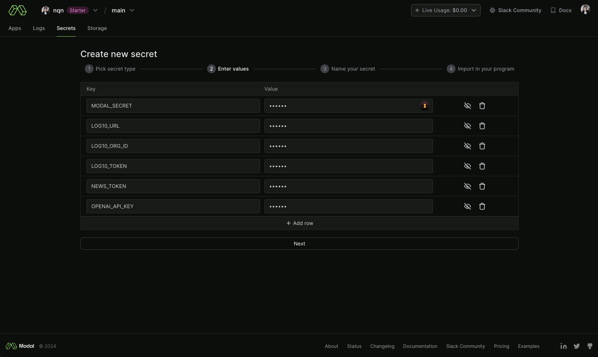

# Log10 News Summarizer App

This is a [Log10](https://log10.io) demo application which summarizes news articles and use AutoFeedback to grade the quality of the LLM output.


## Setup

The application is built to be run on [vercel](https://vercel.com) and [modal](https://modal.com) and use OpenAI for summarization:


Start by forking this repository so it is available in your profile at https://github.com/\<your handle\>/news-summarizer by clicking the fork button in github.


### Log10

Go to https://log10.io/signup and create an organization, if you don't already have one.

Once you get to the on-boarding screen, click the "Summary grading" example feedback task.


This should redirect you to the feedback screen in Log10. To get your credentials, the fastest way is to click "add feedback".


**Save the credentials in the instructions when setting up the modal backend.**


These will go in the `LOG10_URL`, `LOG10_ORG_ID` and `LOG10_TOKEN` environment variables.

### OpenAI

Sign up with OpenAI, if you don't already have an account [here](https://platform.openai.com/signup) or [login](https://platform.openai.com/).

Go to the [API keys page](https://platform.openai.com/api-keys) and create a key and save it for later. This will go in the `OPENAI_API_KEY` environment variable.


### NewsAPI

Create a NewAPI key [here](https://newsapi.org/register) ans save it for later. This will go in the `NEWS_TOKEN` environment variable.

### Modal

Start by creating a secret that ensures that only your frontend can access your modal endpoint:

```
$ uuidgen
```

Save this value, or make up your own secret. This will go in the `MODAL_SECRET` environment variable.

Then create an account in modal [here](https://modal.com/signup).

#### Secrets

At this point, you should have the values for the following secrets:

| Name | Description |
| ---- | ----------- |
| MODAL_SECRET | Secret key that protects your modal endpoint |
| LOG10_URL | API URL for Log10. **NOTE** Do not include trailing slash |
| LOG10_ORG_ID | Your Organization ID in Log10. This is an UUID and not the slug i.e. short name |
| LOG10_TOKEN | Your API token to log10 |
| NEWS_TOKEN | Token for newsapi.org account |
| OPENAI_API_KEY | Your openai key |


When you have logged in, click the secrets tab and click "Create new secret"


Then click "Custom":


And create secrets for log10, openai and the newsapi:



Then, name the secret "news-secret":


And finalize the secret creation.

#### Installing modal and deploying service


```bash
$ cd service
$ virtualenv venv
$ . ./venv
$ pip install -r requirements.txt
$ python3 -m modal setup
# Follow instructions to log into your modal account
$ modal deploy main.py
```

This should print out something like:

```
✓ Created objects.
├── 🔨 Created mount /Users/niklasqnielsen/workspace/log10/news-summarizer/service/main.py
└── 🔨 Created fastapi_app => https://<your handle>--news-summarizer-fastapi-app.modal.run
✓ App deployed! 🎉
```

Note down the `https://<your handle>--news-summarizer-fastapi-app.modal.run` for setting up vercel.

### Vercel / Web app

Log in with your github credentials [here](https://vercel.com/login), and click "Add new..." and select "Project".


Now set the modal endpoint and secret that you noted above in the environment variable list, and click deploy.


After the site has been deployed, you should now be able to go to the vercel url and see the new summarizer.


